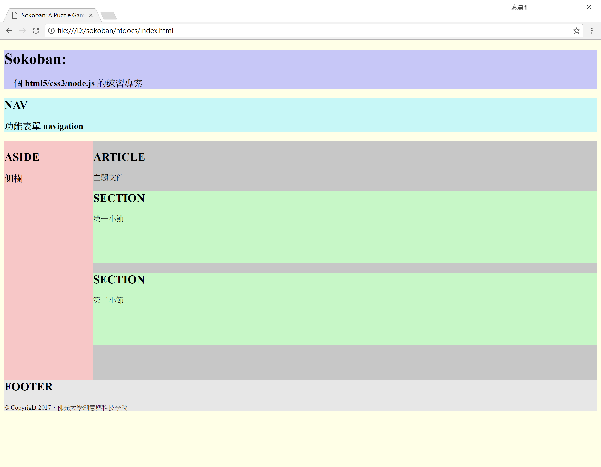

<!---
  @file       sketch.md
  @author     Yiwei Chiao (ywchiao@gmail.com)
  @date       10/19/2017 created.
  @date       10/19/2017 last modified.
  @version    0.1.0
  @copyright  CC-BY, (C) 2017 Yiwei Chiao
-->

# 簡單的 HTML 版面架構

 目前 `index.html` 看起來看單純的 `Hello World!` 沒什麼兩樣。因為整個還沒有
 置入文件結構和版面訊息。為了對 [HTML][mdnHTML] 文件結構和版面的關係有個基本的
 理解，Figure \ref{html:layout} 利用 [CSS][mdnCSS] 將 [HTML][mdnHTML]
 不同版塊設定不同的背景顏色，以呈現 [HTML][mdnHTML] 元素之間的關聯。

  

## [HTML][mdnHTML] 和內嵌的 [CSS][mdnCSS]

 Figure \ref{html:layout} 的源碼如下：

```html
 1. <!DOCTYPE html>
 2. <html lang="zh-TW">
 3.   <head>
 4.     <meta charset="utf-8">
 5.     <meta name="viewport" content="width=device-width,
          initial-scale=1.0">
 7.
 8.     <title>Sokoban: A Puzzle Game</title>
 9.     <meta name="author" content="Yiwei Chiao">
10.     <meta name="description" content="A web-based Sokoban
          (倉庫番) game.">
11.     <meta name="keywords" content="Javascript, game, Sokoban">
12.   </head>
13.   <body style="background-color: #ffffe7;">
14.     <header style="background-color: #c7c7f7;">
15.       <h1>Sokoban:</h1>
16.       <h3>一個 html5/css3/node.js 的練習專案</h3>
17.     </header>
18.     <nav style="background-color: #c7f7f7;">
19.       <h2>NAV</h2>
20.       <h3>功能表單 navigation</h3>
21.     </nav>
22.     <aside style="background-color: #f7c7c7; width: 15%;
          height: 500px; float: left;">
23.       <h2>ASIDE</h2><h3>側欄</h3>
24.     </aside>
25.     <article style="background-color: #c7c7c7; width: 85%;
          height: 500px; float: left;">
26.       <h2>ARTICLE</h2>
27.       主題文件
28.       <section style="background-color: #c7f7c7;
            height: 150px;">
29.         <h2>SECTION</h2>
30.         第一小節
31.       </section>
32.       <section style="background-color: #c7f7c7;
            height: 150px;">
33.         <h2>SECTION</h2>
34.         第二小節
35.       </section>
36.     </article>
37.     <footer style="background-color: #e7e7e7;">
38.       <h2>FOOTER</h2>
          <small>&copy; Copyright 2017，佛光大學創意與科技學院<small>
39.     </footer>
40.   </body>
41. </html>
```

 約 40 行的 [HTML][mdnHTML] 碼，看起來是有那麼點手足無措。對照 Figure
 \ref{html:layout}，將 `index.html` 的 `<body></body>` 結構獨立出來後，
 其實只有如下約 20 行的內容：

```html
13.   <body style="background-color: #ffffe7;">
14.     <header style="background-color: #c7c7f7;">
17.     </header>
18.     <nav style="background-color: #c7f7f7;">
21.     </nav>
22.     <aside style="background-color: #f7c7c7; width: 15%;
          height: 500px; float: left;">
24.     </aside>
25.     <article style="background-color: #c7c7c7; width: 85%;
          height: 500px; float: left;">
28.       <section style="background-color: #c7f7c7;
            height: 150px;">
31.       </section>
32.       <section style="background-color: #c7f7c7;
            height: 150px;">
35.       </section>
36.     </article>
37.     <footer style="background-color: #e7e7e7;">
39.     </footer>
40.   </body>
```

 為了讓 [HTML][mdnHTML5] 的 `<tag>` 能更清楚的表達文件的結構，網頁設計者能更
 明確地將他/她的設計意圖傳逹給瀏覽器，[HTML5][mdnHTML5] 引入了一些，如上面片段裡的，新的**語義化** (semantic) 的 `<tag>` 來標示文件結構：

  * `<header></header>`: 用來放網頁横幅 (banner)，摘要 (abstract)
   等表頭 (head) 資訊。
  * `<footer></footer>`: 放置版權聲明，腳註 (footnote) 資料，頁碼等。
  * `<nav></nav>`: 分頁，功能表，等引導使用者在網頁內移動的資訊。
  * `<aside></aside>`: 側橺。置放和主要文章的相關資料或導覽。
  * `<article></article>`: 主題文草。
  * `<section></section>`: 文件段落。

 在如 `<body style="background-color: #ffffe7;">` 內出現的
 `style="..."` 就是所謂的 [CSS][mdnCSS]。如在上面的 `index.html` 源碼裡
 看到的，在 [CSS][mdnCSS] 裡可以利用 `background-color` 來設定背景顏色；
 `height`, `width` 屬性等。

 像這樣將 [CSS][mdnCSS] 設定直接利用 [HTML][mdnHTML5] `tag` 的 `style`
 屬性寫在 [HTML][mdnHTML5] 檔案裡稱為 *embedded CSS*，嵌入式的寫法。這種作
 法在 Web 早期還沒有目前這麼泛用，或簡單網頁時很方便；但明顯已無法應付現在對網頁
 的嚴苛要求。因此，目前作法多會將 [CSS][mdnCSS] 獨立在自己的 `.css` 檔內，再
 利用 `<head>` 區塊裡的 `<link> tag` 來結合兩者。

[github]: https://github.com/
[githubHead]: https://github.com/joshbuchea/HEAD
[mdnCSS]: https://developer.mozilla.org/en-US/docs/Web/CSS
[mdnHTML]: https://developer.mozilla.org/en-US/docs/Web/HTML
[mdnHTML5]: https://developer.mozilla.org/en-US/docs/Web/Guide/HTML/HTML5
[wikiHTML]: https://en.wikipedia.org/wiki/HTML
[wikiMarkdown]: https://en.wikipedia.org/wiki/Markdown
[wikiMarkupLang]: https://en.wikipedia.org/wiki/Markup_language
[wikiMetadata]: https://en.wikipedia.org/wiki/Metadata
[wikiProgLang]: https://en.wikipedia.org/wiki/Programming_language
[wikiText]: https://en.wikipedia.org/wiki/Text_(literary_theory)
[wikiXML]: https://en.wikipedia.org/wiki/XML
[wikiYAML]: https://en.wikipedia.org/wiki/YAML

<!-- sketch.md -->
