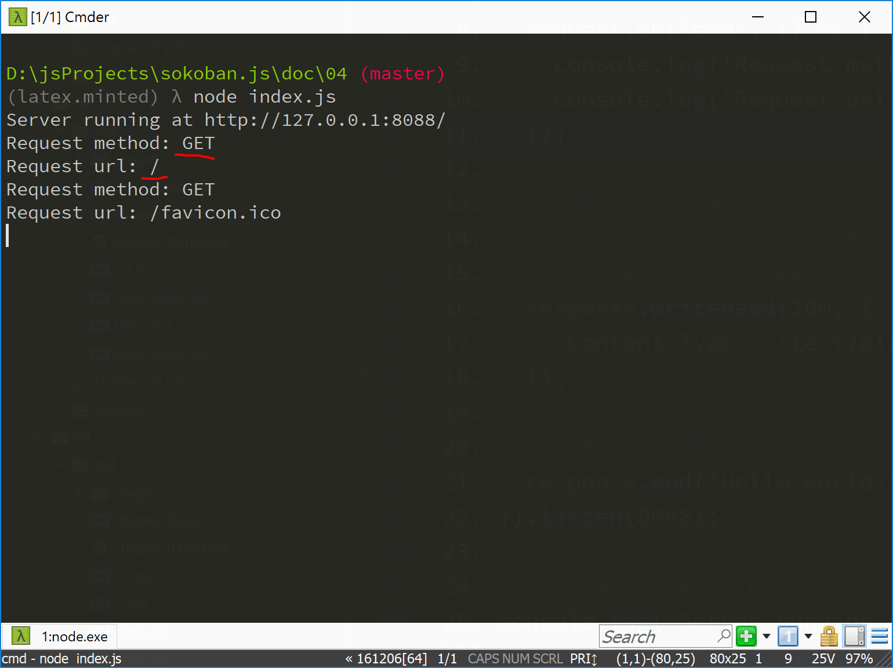
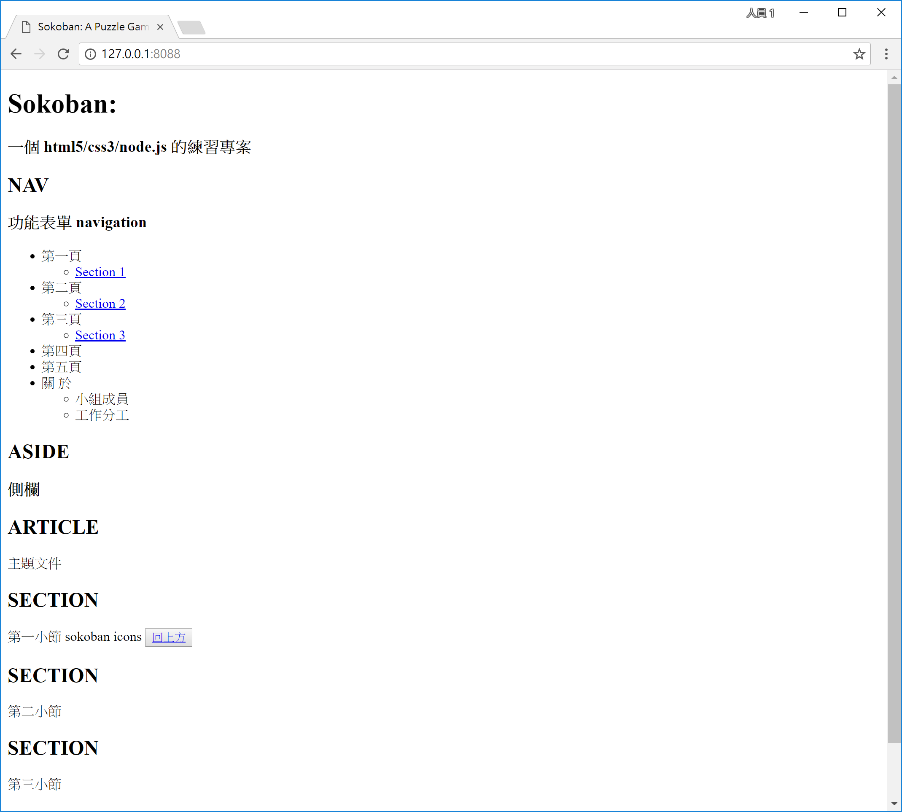
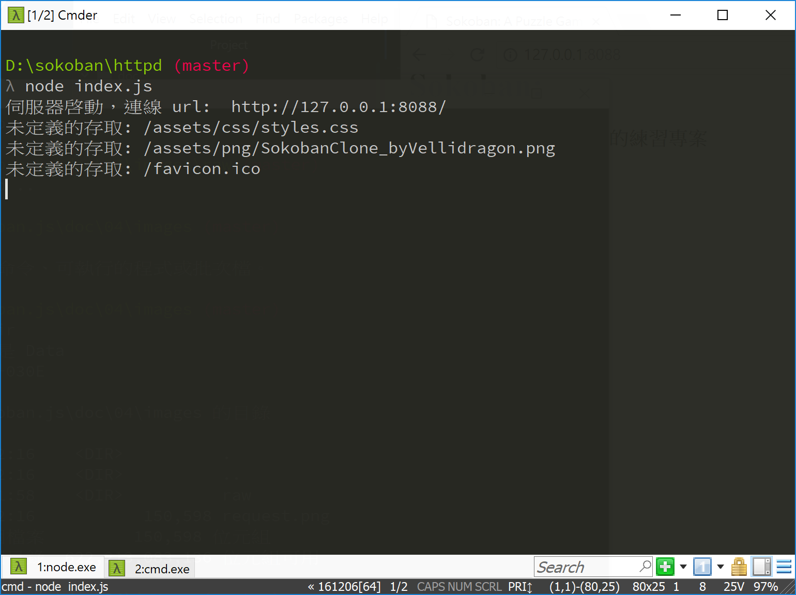

<!---
  @file       chapter_04.md
  @date       12/22/2017 created.
  @copyright  CC-BY, (C) 2017 Yiwei Chiao
  @detail
    This file is machine-generated. DONOT MODIFY IT DIRECTLY.
-->
# 簡介

 目前 [Sokoban][sokoban.js] 專案裡有四 (4) 個檔案:

  * `index.js` 在 `sokoban/httpd` 資料夾下，網頁伺服的主程式。
  * `index.html` 在 `sokoban/htdocs` 資料夾下，網頁客戶端的 [HTML][mdnHTML5] 框架。
  * `styles.css` 在 `sokoban/htdocs/assets/css` 資料夾下，負責網頁客戶端
   的 [CSS][mdnCSS] styling。
  * `SokobanClone_byVellidragon.png` 在 `sokoban/htdocs/assets/png`
   資料夾下，作為之後使用的繪圖素材。

 問題在之前伺服端的 `index.js` 檔案執行時**只**是簡單地讀入 `index.html` 檔案內容，並將它傳給客戶端瀏覽器；現在多了 `styles.css`, `SokobanClone_byVellidragon.png` 等不同形式的檔案，`index.js` 應該在
 **何時**，**如何** 讀取它們的內容並傳給客戶端，就是現在要處理的挑戰。

## [`http.IncomingMessage`][http_inmsg]

 原始的 `index.js` 內容如下：

```JavaScript
 1. 'use strict';
 2.
 3. let http = require('http');
 4.
 5. http.createServer((request, response) => {
 6.   // 傳送 HTTP header
 7.   // HTTP Status: 200 : OK
 8.   // Content Type: text/plain
 9.   response.writeHead(200, {
10.     'Content-Type': 'text/plain'
11.   });
12.
13.   // 傳送回應內容。
14.   response.end('Hello World!\n');
15.
16.   console.log('request.headers: \n', request.headers)
17. }).listen(8088);
18.
19. // log message to Console
20. console.log('伺服器啓動，連線 url:  http://127.0.0.1:8088/');
```

  目前關注的是第 5 行的 `http.createServer((request, response) => {`。
  這裡，`index.js` 建立了真正的 `HTTP` 伺服器物件；而 `request` 參數就是客
  戶端送來的請求。

  據 [Node.js][nodejs] 文件，`request` 物件的型別是
  [`http.IncomingMessage`][http_inmsg]。由
  [Node.js][nodejs] 文件裡對 [`http.IncomingMessage`][http_inmsg] 的明，可以找到兩個重要的資料欄位：

  * `message.method`: 客戶端要求使用的**方法**，如：`GET`，`POST` 等；
  * `message.url`: 客戶端提出要求使用的 `URL` (Uniform Resource
   Locator)，也就是一般習稱的**網址**。

  要理解這兩個欄位的意義，可以修改 `index.js` 如下：

```javascript
 1. 'use strict';
 2.
 3. let http = require('http');
 4.  
 5. http.createServer((request, response) => {
 6.   request.on('end', () => {
 7.     console.log('Request method: ' + request.method);
 8.     console.log('Request url: ' + request.url);
 9.   });
10.
11.   // 傳送 HTTP header
12.   // HTTP Status: 200 : OK
13.   // Content Type: text/plain
14.   response.writeHead(200, {
15.     'Content-Type': 'text/plain'
16.   });
17.
18.   // 傳送回應內容。
19.   response.end('Hello World!\n');
20. }).listen(8088);
21.  
22. // log message to Console
23. console.log('Server running at http://127.0.0.1:8088/');
```

 主要差別在增加了第 6 ~ 9 行的程式碼。其中第 6 行設定當 HTTP 伺服完成接收
 `request` 物件時執行；而第 7, 8 行則分別在 `console` 印出
 `request.method` 和 `request.url` 的內容。執行結果應該有點像圖 Figure
 \ref{http_request}，

 

 伺服器可以利用這兩個欄位來達成回傳不同檔案的目的。

## `index.js` 修正

 依之前對 `request.method` 和 `request.url` 的了解，`index.js` 可以修改
 如下：

```javascript
 1. 'use strict';
 2.
 3. let http = require('http');
 4.
 5. http.createServer((request, response) => {
 6.   let fs = require('fs');
 7.   let postData = ''; // POST 資料
 8.
 9.   // 利用 'data' event 消耗掉 data chunk;
10.   // 'end' event 才會被 fired
11.   request.on('data', (chunk) => {
12.     postData += chunk;
13.
14.     console.log(
15.       '接收的 POST data 片段k: [' + chunk + '].'
16.     );
17.   });
18.
19.   request.on('end', () => {
20.     switch (request.url) {
21.       case '/':
22.         fs.readFile('../htdocs/index.html', (err, data) => {
23.           if (err) {
24.              console.log('檔案讀取錯誤');
25.           }
26.           else {
27.             response.writeHead(200, {
28.               'Content-Type': 'text/html'
29.             });
30.
31.             response.write(data);
32.             response.end();
33.           }
34.         });
35.
36.         break;
37.
38.       default:
39.         console.log('未定義的存取: ' + request.url);
40.
41.         response.end();
42.
43.         break;
44.     }
45.   });
46. }).listen(8088);
47.
48. // log message to Console
49. console.log('伺服器啓動，連線 url:  http://127.0.0.1:8088/');
```

## 問題與練習

  修改過後的 `index.js` 執行結果如圖 Figure
  \ref{http_homework}，

  

  而伺服端的輸出如圖 Figure \ref{http_switched}，

  

  嘗試解決這個問題。

[mdnCSS]: https://developer.mozilla.org/en-US/docs/Web/CSS  

<!-- routing.md -->

# 簡介

 目前 `index.js` 利用 `switch` 指令來依據使用者要求，傳回不同的檔案內容到
 瀏覽器端。程式碼片段類似下面的型態：

```javascript
19.  request.on('end', () => {
20.    switch (request.url) {
21.      case '/':
22.        fs.readFile('../htdocs/index.html', (err, data) => {
23.          if (err) {
24.             console.log('檔案讀取錯誤');
25.          }
26.          else {
27.            response.writeHead(200, {
28.              'Content-Type': 'text/html'
29.            });
30.
31.            response.write(data);
32.            response.end();
33.          }
34.        });
35.
36.        break;
37.
38.      case '/assets/css/styles.css':
39.        fs.readFile('../htdocs/assets/css/styles.css', (err, data) => {
40.          if (err) {
41.            console.log('檔案讀取錯誤');
42.          }
43.          else {
44.            response.writeHead(200, {
45.              'Content-Type': 'text/css'
46.            });
47.
48.            response.write(data);
49.            response.end();
50.          }
51.        });
52.
53.        break;
54.
55.      case '/assets/png/SokobanClone_byVellidragon.png':
56.        fs.readFile(
57.          '../htdocs/assets/png/SokobanClone_byVellidragon.png',
58.          (err, data) => {
59.            if (err) {
60.              console.log('檔案讀取錯誤');
61.            }
62.            else {
63.              response.writeHead(200, {
64.                'Content-Type': 'image/png'
65.              });
66.
67.              response.write(data);
68.              response.end();
69.            }
70.          }
71.        );
72.
73.        break;
74.            
75.      default:
76.        console.log('未定義的存取: ' + request.url);
77.
78.        response.end();
79.
80.        break;
81.     }
```

 原則上就是依第 `76` 行回報的**未定義的存取**，增加 `switch` 陳述裡的
 `case` 分支，回應相對應的**檔案內容**。看起來不差，可是如果，多一個要求，就
 多一段 `swtich case` 陳述，對複雜一點的網站來說，可能很快就會耗盡我們的腦容量
 來追踪。

 我們需要一個**聰明點**的方法。

## 抽離獨立函式

 首先注意到，第 `22~34`, `39~51` 和 `56~71` 的程式碼**基本上**完全相同，
 只有 `fs.readFile(...)` 的檔名參數和 `response.writeHead(....)` 的
 `Content-Type` 參數不同。這並不意外，因為這些程式碼本來就是 `22~34` 行程式
 碼的複製品 (copy)。可以想見，如果再增加 `case`，可能也只是再增加一份 `22~34`
 的 copy 而已。

 所以，第一步可以將 `22~34` 抽離成一個獨立的函式 (function)，如下。

```javascript
/**
  * 利用 http.ServerResponse 物件回傳檔案內容
  *
  * @name serve
  * @function
  * @param response - http.ServerResponse 物件
  * @param fname - 要回傳的檔案名
  * @param datatype - 回傳檔案內容的 Mine-Type
  * @returns {undefined}
  */
let serve = (response, fname, datatype) => {
  let fs = require('fs');

  fs.readFile(fname, (err, data) => {
    if (err) {
      console.log('檔案讀取錯誤');
    }
    else {
      response.writeHead(200, {
        'Content-Type': datatype
      });

      response.write(data);
      response.end();
    }
  });
};
```

 上面的程式碼定義了一個新的函數，稱為 `serve`，它需要三 (3) 個參數，分別是 `http.ServerResponse`, 檔案名稱 (`fname`) 和資料的 Mine-Type。可以自到
 函式的內容就是原始 `switch case` 裡的內容。有了這個函數，原來的 `switch` 可以改寫成：

```javascript
    switch (request.url) {
      case '/':
        serve(response, '../htdocs/index.html', 'text/html');

        break;

      case '/assets/css/styles.css':
        serve(response, '../htdocs/assets/css/styles.css', 'text/css');

        break;

      case '/assets/png/SokobanClone_byVellidragon.png':
        serve(
          response,
          '../htdocs/assets/png/SokobanClone_byVellidragon.png',
          'image/png'
        );

        break;

      default:
        console.log('未定義的存取: ' + request.url);

        response.end();

        break;
    }
```

 如此，大幅簡化了 `switch` 陳述。

 完整的 `index.js` 如下：

```javascript
'use strict';

let http = require('http');

/**
  * 利用 http.ServerResponse 物件回傳檔案內容
  *
  * @name serve
  * @function
  * @param response - http.ServerResponse 物件
  * @param fname - 要回傳的檔案名
  * @param datatype - 回傳檔案內容的 Mine-Type
  * @returns {undefined}
  */
let serve = (response, fname, datatype) => {
  let fs = require('fs');

  fs.readFile(fname, (err, data) => {
    if (err) {
      console.log('檔案讀取錯誤');
    }
    else {
      response.writeHead(200, {
        'Content-Type': datatype
      });

      response.write(data);
      response.end();
    }
  });
};

http.createServer((request, response) => {
  let fs = require('fs');

  let postData = '';

  // 利用 'data' event 消耗掉 data chunk;
  // 'end' event 才會被 fired
  request.on('data', (chunk) => {
    postData += chunk;

    console.log(
      '接收的 POST data 片段: [' + chunk + '].'
    );
  });

  request.on('end', () => {
    switch (request.url) {
      case '/':
        serve(response, '../htdocs/index.html', 'text/html');

        break;

      case '/assets/css/styles.css':
        serve(response, '../htdocs/assets/css/styles.css', 'text/css');

        break;

      case '/assets/png/SokobanClone_byVellidragon.png':
        serve(
          response,
          '../htdocs/assets/png/SokobanClone_byVellidragon.png',
          'image/png'
        );

        break;

      default:
        console.log('未定義的存取: ' + request.url);

        response.end();

        break;
    }
  });
}).listen(8088);

// log message to Console
console.log('伺服器啓動，連線 url:  http://127.0.0.1:8088/');

// index.js
```

## 建立**路由表** (routing table)

 將 `serve()` 函數獨立出去後，`index.js` 是有了大幅改善，但還是不能滿意。
 因為，還是要為新的 `request.url` 增加新的 `switch case`；還是在增加腦子的
 負荷。

 重新審視 `switch case` 陳述，可以注意到，`switch case` 的用途不過是用來將
 `request.url` 對應到真正的**檔案內容**和檔案內容的*Mine-Type*，沒有其它的
 用途。而如果只是為了作**對應** (mapping)，有個更古老，好用的方法來處理，
 **查表** (table lookup)。這裡，借用電腦網路的名詞，就稱這個將要建立的**表**
 是一個**路由表** (routing table)。

 下面是建立出來的路由表：

```javascript
const routingTable = {
  '/': {
      url: '../htdocs/index.html',
      type: 'text/html'
    },
  '/assets/css/styles.css': {
      url: '../htdocs/assets/css/styles.css',
      type: 'text/css'
    },
  '/assets/png/SokobanClone_byVellidragon.png': {
      url: '../htdocs/assets/png/SokobanClone_byVellidragon.png',
      type: 'image/png'
    },
};
```

 如上表顯示的，所謂的 **routing table** 在程式裡其實就是一個普通的
 [JavaScript][mdnJavaScript] 物件 (object)；只不過這個**物件**的**屬性**
 (property) 設計過，每一個**屬性**的名稱都對應一個不同的 `request.url`，而
 它的**屬性值** (value) 則是另一個簡單的物件，記錄了真實的檔案位置和對應的
 *Mine-Type*。

 有了 `routingTable` 的協助，`request.on('end')` 的程式片段可以改寫如下：

```javascript
   request.on('end', () => {
     if (request.url in routingTable) {
       let obj = routingTable[request.url];

       serve(response, obj.url, obj.type);
     }
     else {
       console.log('未定義的存取: ' + request.url);

       response.end();
     }
   });
```

 原來的 `switch` 陳述不見了，而且更棒的是，如果有新的 `request.url` 出現，這裡不用作任何事情，只需要去修改 `routingTable` 的定義就行了。

## 簡化路由表

 最後再回頭看一眼剛定義的 `routingTable`。注意到除了 `'/'` 對應到
 `'../htdocs/index.html'`，使得 `request.url` 和**真實**的 `url` 不同
 之外，另外兩組的 `request.url` 和**真實**的 `url` 幾乎完全相同。這有個重大
 的缺點：
 * 將網站的內部結構以 url 的型式暴露在外。

 `request.url` 基本上就是使用者在瀏覽器網址列上輸入的網址，或 `.html` 裡記錄
 的 `url link`。讓它和網站上的目錄結構作完整的對應，等於告訴使用者網站的架構
 安排是什麼樣子。讓網站暴露在不必要的風險中。

 還好，`routingTable` 本身就是個對應表，修改這個表就可以解決問題。而修改的
 目標，除了斷離 `request.url` 和**真實** url 的字面聯繫外，當然也希望簡化
 使用者的麻煩。所以，簡化的方向在 `request.url` 上。

 先看修改過的 `routingTable`。

```javascript
const routingTable = {
  '/': {
      url: '../htdocs/index.html',
      type: 'text/html'
    },
  '/styles.css': {
      url: '../htdocs/assets/css/styles.css',
      type: 'text/css'
    },
  '/SokobanClone_byVellidragon.png': {
      url: '../htdocs/assets/png/SokobanClone_byVellidragon.png',
      type: 'image/png'
    },
};
```

簡單說，就是將 `request.url` 裡的路徑資訊**移除**。而相對應的，需要修改 `index.html`。而這一部份就留作練習。

最後，附上到目前為止，完整的 `index.js` 檔。

```javascript
 1. 'use strict';
 2.
 3. let http = require('http');
 4.
 5. const routingTable = {
 6.   '/': {
 7.       url: '../htdocs/index.html',
 8.       type: 'text/html'
 9.     },
10.   '/styles.css': {
11.       url: '../htdocs/assets/css/styles.css',
12.       type: 'text/css'
13.     },
14.   '/SokobanClone_byVellidragon.png': {
15.       url: '../htdocs/assets/png/SokobanClone_byVellidragon.png',
16.       type: 'image/png'
17.     },
18. };
19.
20. /**
21.   * 利用 http.ServerResponse 物件回傳檔案內容
22.   *
23.   * @name serve
24.   * @function
25.   * @param response - http.ServerResponse 物件
26.   * @param fname - 要回傳的檔案名
27.   * @param datatype - 回傳檔案內容的 Mine-Type
28.   * @returns {undefined}
29.   */
30. let serve = (response, fname, datatype) => {
31.   let fs = require('fs');
32.
33.   fs.readFile(fname, (err, data) => {
34.     if (err) {
35.       console.log('檔案讀取錯誤');
36.     }
37.     else {
38.       response.writeHead(200, {
39.         'Content-Type': datatype
40.       });
41.
42.       response.write(data);
43.       response.end();
44.     }
45.   });
46. };
47.
48. http.createServer((request, response) => {
49.   let fs = require('fs');
50.
51.   let postData = '';
52.
53.   // 利用 'data' event 消耗掉 data chunk;
54.   // 'end' event 才會被 fired
55.   request.on('data', (chunk) => {
56.     postData += chunk;
57.
58.     console.log(
59.       '接收的 POST data 片段k: [' + chunk + '].'
60.     );
61.   });
62.
63.   request.on('end', () => {
64.     if (request.url in routingTable) {
65.       let obj = routingTable[request.url];
66.
67.       serve(response, obj.url, obj.type);
68.     }
69.     else {
70.       console.log('未定義的存取: ' + request.url);
71.
72.       response.end();
73.     }
74.   });
75. }).listen(8088);
76.
77. // log message to Console
78. console.log('伺服器啓動，連線 url:  http://127.0.0.1:8088/');
79.
80. // index.js
```

## 問題與練習

 修改 `htdocs/index.html` 使得目前版本的 `index.js` 還是可以正常顯示內容。

<!-- router.md -->

# 配置檔 (`configuration file`)

 在 `index.js` 引入了 `routingTable` 之後，利用**查表法**大幅簡化了 `http
 request` 和 `http service` 間的對應關係。可是目前 `routingTable` 是埋在
 密密麻麻的程式碼裡，如果要修改表的內容就等於是在修改程式碼。有沒有可能將
 `routingTable` 的內容完全獨立在程式碼之外，任何之後的修改都不用再動到程式碼？

 上面的問題就是所謂**配置檔** (configuration file) 的動機。

 `Configuration file` 的概念出現之後，這個檔案有各式各樣的檔案格式 (file
 format) 曾經/目前被使用過。除了少數特殊考量之外，所有的格式都是人類可閱讀的
 簡單文字檔 (text file)，目的是為了讓使用者能在不需要大量技術支援的情況下，快速
 理解並調整系統配置。

 這裡 [Sokoban.js] 專案將採用 [JSON][] 格式作為它的系統配置檔。一個原因是是
 [JSON][] 格式簡單易學；另一個原因則是 [JSON][] 目前己經是 Web 領域，客戶端
  (browser) 和伺服端 (http server) 交換資料的主要格式。好 [JSON][]，不學
 嗎？

## [JSON][] 格式

 [JSON][] 其實是 `JavaScript Object Notation` 的字首縮寫。如它名字所表示
 的 [JSON][] 檔案的內容就是一個合法的 [JavaScript][mdnJavaScript] 物件表
 示式 (object literal)。或者，由這裡也可以看出為什麼 [JSON][] 格式會在 Web
 領域裡受到廣泛的歡迎。

 直接看 `index.js` 裡的 `routingTable` (對了，`index.js` 的
 `routingTable` 寫法就是 [JavaScript][mdnJavaScript] 的 `Object
 literal`) 寫成 [JSON][] 格式的模樣：

```json
 1. {
 2.   "/": {
 3.     "url": "../htdocs/index.html",
 4.     "type": "text/html"
 5.   },
 6.   "/styles.css": {
 7.     "url": "../htdocs/assets/css/styles.css",
 8.     "type": "text/css"
 9.   },
10.   "/SokobanClone_byVellidragon.png": {
11.     "url": "../htdocs/assets/png/SokobanClone_byVellidragon.png",
12.     "type": "image/png"
13.   }
14. }
```

 可以和原來 `index.js` 裡的 `routingTable` 對照看。原則上 [JSON][] 和
 [JavaScript][mdnJavaScript] 的 `object literals` 完全相同，都採用：

```javascript
{
  key: value
}
```

 的格式。但 [JSON][] 的定義更嚴謹，而有幾個明顯/要注意的不同點：

  * `key`: [JavaScript][mdnJavaScript] 的 `key` 是簡單字串的話，可以
   不用加字串引號 (single/double quote) `"'"` 或 `'"'`；而如果要加
   **引號** (quotation mark)，只要前後一致，單，雙引號都可以。[JSON][] 的
   `key` 則**一定**要用**雙引號** (double quotes)
  * 多組 `key: value` 間的分隔逗點 ",": [JSON][] 和
   [JavaScript][mdnJavaScript] 的 `object literals` 都採用**逗點**
   "," 來分隔不同的 `key: value`；要注意的是**最後一組** `key: value`。
   [JavaScript][mdnJavaScript] 會**容忍**最後一組的 `key: value,` 後面的那個**逗號**；但 [JSON][] **不會**。[JOSN][] 認為那是錯誤。
  * `{}`: `{}` 用來標示物件的開始和結束，在 [JavaScript][mdnJavaScript]
   裡，很自然的 `{` 前面可能有 `=`， `(` 之類的符號，而 `}` 後面可能也有 `)`
   或 `;` 跟著；但 [JSON][] 裡，這些都是**不允許**的。因為沒必要。
  * 註解 (comments)：[JSON][] 格式**不允許**註解，**不允許**註解，
   **不允許**註解。很重要，所以說三次。這是 [JSON][] 格式最具爭議的一個設計決
   定。但 [JSON][] 設計者堅持 [JSON][] 格式簡單到不需要註解；更不需要註解來污
   染這格式的簡單純粹。真需要註解，有其它格式可選，結案。

 除去這些更嚴謹的設定不同，[JSON][] 格式的文件就是  [JavaScript][mdnJavaScript] 的 object literal；換句話說，就是個合法的
 [JavaScript][mdnJavaScript] 程式檔案，只是副檔名 (延伸檔名) 使用 '.json'
 或 '.js' 的不同而已。因此，格式在 2007 (或之前) 提出後很快的就被 Web 開發社群接受。

## `config.json`

 理解 [JSON][] 格式的意義，就可以將 `routingTable` 的定義移到
 `config.json` 檔案內。利用文字編輯器 (text editor) 建立 `config.json` 檔案，內容如前一小節所示，就是原來 `index.js` 內 `routingTable` 的內容。

 將 `config.json` 和 `index.js` 放在同一個資料夾。然後修改 `index.js`，
 把第五 (5) 行到第 (18) 的程式碼：

```javascript
5. const routingTable = {
6.   '/': {
7.       url: '../htdocs/index.html',
8.       type: 'text/html'
9.     },
10.   '/styles.css': {
11.       url: '../htdocs/assets/css/styles.css',
12.       type: 'text/css'
13.     },
14.   '/SokobanClone_byVellidragon.png': {
15.       url: '../htdocs/assets/png/SokobanClone_byVellidragon.png',
16.       type: 'image/png'
17.     },
18. };
```

 更改成：

```javascript
 5. const routingTable = require('./config.json');
```

 是的，就這樣。因為如同前面對 [JSON][] 格式的介紹，[JSON][] 檔案本身就是個
 合法的 [JavaScript][mdnJavaScript] 檔案，它的內容其實可以視作是一個
 **匿名** (anonymous) 的物件宣告。所以可以直接當作 [Node.js][nodejs] 的
 模組載入使用。

[JSON]: https://www.json.org/

<!-- config.md -->

[android]: https://developer.android.com
[ECMAScript]: https://www.ecma-international.org/publications/standards/Ecma-262.htm
[nodejs]: https://nodejs.org
[sokoban]: https://en.wikipedia.org/wiki/Sokoban
[sokobanjs]: https://github.com/ywchiao/sokoban.js.git
[sokoban.android]: https://github.com/ywchiao/sokoban
[atom]: https://atom.io
[babeljs]: https://babeljs.io
[browserify]: http://browserify.org
[git]: https://git-scm.com
[github]: https://github.com
[ide]: https://en.wikipedia.org/wiki/Integrated_development_environment
[rollupjs]: https://rollupjs.org
[torvalds]: https://en.wikipedia.org/wiki/Linus_Torvalds
[typescript]: https://www.typescriptlang.org
[uglifyjs]: https://github.com/mishoo/UglifyJS2
[vcs]: https://en.wikipedia.org/wiki/Version_control
[vscode]: https://github.com/Microsoft/vscode
[webpack]: https://webpack.github.io
[brew]: https://github.com/Homebrew/brew
[cli]: https://en.wikipedia.org/wiki/Command-line_interface
[cmder]: https://github.com/cmderdev/cmder
[gui]: https://en.wikipedia.org/wiki/Graphical_user_interface
[npm]: https://www.npmjs.com
[nvm]: https://github.com/creationix/nvm
[vim]: https://vim.sourceforge.io
[xcode]: https://developer.apple.com/xcode
[commonmark]: http://commonmark.org
[gfm]: https://github.github.com/gfm
[gitignore]: https://git-scm.com/docs/gitignore
[markdown]: https://en.wikipedia.org/wiki/Markdown
[MIT]: https://opensource.org/licenses/MIT
[scriptingLanguage]: https://en.wikipedia.org/wiki/Scripting_language
[shellScript]: https://en.wikipedia.org/wiki/Shell_script
[sokoban.js]: https://github.com/ywchiao/sokoban.js.git
[amd]: http://requirejs.org/docs/whyamd.html
[arrowfunction]: https://developer.mozilla.org/zh-TW/docs/Web/JavaScript/Reference/Functions/Arrow_functions
[clientrequest]: https://nodejs.org/api/http.html#http_class_http_clientrequest
[closure]: https://developer.mozilla.org/zh-TW/docs/Web/JavaScript/Closures
[commonjs]: http://www.commonjs.org
[console]: https://nodejs.org/api/console.html#console_class_console
[createserver]: https://nodejs.org/api/http.html#http_http_createserver_requestlistener
[http]: https://en.wikipedia.org/wiki/Hypertext_Transfer_Protocol
[httpmod]: https://nodejs.org/api/http.html#http_http
[httpserver]: https://nodejs.org/api/http.html#http_class_http_server
[iife]: https://en.wikipedia.org/wiki/Immediately-invoked_function_expression
[JavaScript]: https://developer.mozilla.org/zh-TW/docs/Web/JavaScript
[let]: https://developer.mozilla.org/zh-TW/docs/Web/JavaScript/Reference/Statements/let
[mdn]: https://developer.mozilla.org/zh-TW
[mime]: https://developer.mozilla.org/en-US/docs/Web/HTTP/Basics_of_HTTP/MIME_types
[require]: https://nodejs.org/api/modules.html#modules_require
[responseend]: https://nodejs.org/api/http.html#http_response_end_data_encoding_callback
[responsewrite]: https://nodejs.org/api/http.html#http_response_write_chunk_encoding_callback
[responsewritehead]: https://nodejs.org/api/http.html#http_response_writehead_statuscode_statusmessage_headers
[serverlisten]: https://nodejs.org/api/http.html#http_server_listen_port_hostname_backlog_callback
[serverresponse]: https://nodejs.org/api/http.html#http_class_http_serverresponse
[strict]: https://developer.mozilla.org/en-US/docs/Web/JavaScript/Reference/Strict_mode
[var]: https://developer.mozilla.org/zh-TW/docs/Web/JavaScript/Reference/Statements/var
[Unicode]: https://zh.wikipedia.org/wiki/Unicode
[utf8]: https://zh.wikipedia.org/wiki/UTF-8
[mdnCSS]: https://developer.mozilla.org/en-US/docs/Web/CSS
[mdnHTML]: https://developer.mozilla.org/en-US/docs/Web/HTML
[mdnJavaScript]: https://developer.mozilla.org/zh-TW/docs/Web/JavaScript
[wikiCSS]: https://en.wikipedia.org/wiki/Cascading_Style_Sheets
[wikiECMAScript]: https://en.wikipedia.org/wiki/ECMAScript
[wikiHTML]: https://en.wikipedia.org/wiki/HTML
[API]: https://en.wikipedia.org/wiki/Application_programming_interface
[fs]: https://nodejs.org/api/fs.html#fs_file_system
[readfile]: https://nodejs.org/api/fs.html#fs_fs_readfile_path_options_callback
[readfilesync]: https://nodejs.org/api/fs.html#fs_fs_readfilesync_path_options
[githubHead]: https://github.com/joshbuchea/HEAD
[mdnHTML5]: https://developer.mozilla.org/en-US/docs/Web/Guide/HTML/HTML5
[wikiMarkdown]: https://en.wikipedia.org/wiki/Markdown
[wikiMarkupLang]: https://en.wikipedia.org/wiki/Markup_language
[wikiMetadata]: https://en.wikipedia.org/wiki/Metadata
[wikiProgLang]: https://en.wikipedia.org/wiki/Programming_language
[wikiXML]: https://en.wikipedia.org/wiki/XML
[wikiYAML]: https://en.wikipedia.org/wiki/YAML
[sokoban.tiles]: https://opengameart.org/content/sokoban-clone-tiles
[http_inmsg]: https://nodejs.org/api/http.html#http_class_http_incomingmessage
[^android]: https://developer.android.com
[^ECMAScript]: https://en.wikipedia.org/wiki/ECMAScript
[^nodejs]: https://nodejs.org
[^sokoban]: https://en.wikipedia.org/wiki/Sokoban
[^sokobanjs]: https://github.com/ywchiao/sokobna.js
[^sokoban.android]: https://github.com/ywchiao/sokoban
[^atom]: https://atom.io
[^babeljs]: https://babeljs.io
[^browserify]: http://browserify.org
[^git]: https://git-scm.com
[^github]: https://github.com
[^ide]: https://en.wikipedia.org/wiki/Integrated_development_environment
[^rollupjs]: https://rollupjs.org
[^torvalds]: https://en.wikipedia.org/wiki/Linus_Torvalds
[^typescript]: https://www.typescriptlang.org
[^uglifyjs]: https://github.com/mishoo/UglifyJS2
[^vcs]: https://en.wikipedia.org/wiki/Version_control
[^vscode]: https://github.com/Microsoft/vscode
[^webpack]: https://webpack.github.io
[^brew]: https://github.com/Homebrew/brew
[^cli]: https://en.wikipedia.org/wiki/Command-line_interface
[^cmder]: https://github.com/cmderdev/cmder
[^gui]: https://en.wikipedia.org/wiki/Graphical_user_interface
[^npm]: https://www.npmjs.com
[^nvm]: https://github.com/creationix/nvm
[^vim]: https://vim.sourceforge.io
[^xcode]: https://developer.apple.com/xcode
[^commonmark]: http://commonmark.org
[^gfm]: https://github.github.com/gfm
[^gitignore]: https://git-scm.com/docs/gitignore
[^markdown]: https://en.wikipedia.org/wiki/Markdown
[^MIT]: https://opensource.org/licenses/MIT

<!--- chapter_04.md -->