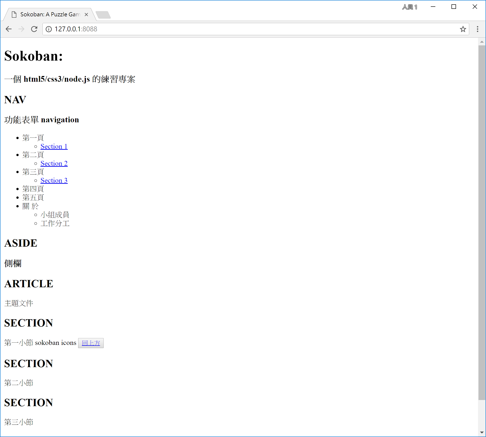

<!---
  @file       routing.md
  @author     Yiwei Chiao (ywchiao@gmail.com)
  @date       11/03/2017 created.
  @date       11/03/2017 last modified.
  @version    0.1.0
  @copyright  CC-BY, (C) 2017 Yiwei Chiao
-->

# 簡介

 目前 [Sokoban][sokoban.js] 專案裡有四 (4) 個檔案:

  * `index.js` 在 `sokoban/httpd` 資料夾下，網頁伺服的主程式。
  * `index.html` 在 `sokoban/htdocs` 資料夾下，網頁客戶端的 [HTML][mdnHTML5] 框架。
  * `styles.css` 在 `sokoban/htdocs/assets/css` 資料夾下，負責網頁客戶端
   的 [CSS][mdnCSS] styling。
  * `SokobanClone_byVellidragon.png` 在 `sokoban/htdocs/assets/png`
   資料夾下，作為之後使用的繪圖素材。

 問題在之前伺服端的 `index.js` 檔案執行時**只**是簡單地讀入 `index.html` 檔案內容，並將它傳給客戶端瀏覽器；現在多了 `styles.css`, `SokobanClone_byVellidragon.png` 等不同形式的檔案，`index.js` 應該在
 **何時**，**如何** 讀取它們的內容並傳給客戶端，就是現在要處理的挑戰。

## [`http.IncomingMessage`][http_inmsg]

 原始的 `index.js` 內容如下：

```JavaScript
 1. 'use strict';
 2.
 3. let http = require('http');
 4.
 5. http.createServer((request, response) => {
 6.   // 傳送 HTTP header
 7.   // HTTP Status: 200 : OK
 8.   // Content Type: text/plain
 9.   response.writeHead(200, {
10.     'Content-Type': 'text/plain'
11.   });
12.
13.   // 傳送回應內容。
14.   response.end('Hello World!\n');
15.
16.   console.log('request.headers: \n', request.headers)
17. }).listen(8088);
18.
19. // log message to Console
20. console.log('伺服器啓動，連線 url:  http://127.0.0.1:8088/');
```

  目前關注的是第 5 行的 `http.createServer((request, response) => {`。
  這裡，`index.js` 建立了真正的 `HTTP` 伺服器物件；而 `request` 參數就是客
  戶端送來的請求。

  據 [Node.js][nodejs] 文件，`request` 物件的型別是
  [`http.IncomingMessage`][http_inmsg]。由
  [Node.js][nodejs] 文件裡對 [`http.IncomingMessage`][http_inmsg] 的明，可以找到兩個重要的資料欄位：

  * `message.method`: 客戶端要求使用的**方法**，如：`GET`，`POST` 等；
  * `message.url`: 客戶端提出要求使用的 `URL` (Uniform Resource
   Locator)，也就是一般習稱的**網址**。

  要理解這兩個欄位的意義，可以修改 `index.js` 如下：

```javascript
 1. 'use strict';
 2.
 3. let http = require('http');
 4.  
 5. http.createServer((request, response) => {
 6.   request.on('end', () => {
 7.     console.log('Request method: ' + request.method);
 8.     console.log('Request url: ' + request.url);
 9.   });
10.
11.   // 傳送 HTTP header
12.   // HTTP Status: 200 : OK
13.   // Content Type: text/plain
14.   response.writeHead(200, {
15.     'Content-Type': 'text/plain'
16.   });
17.
18.   // 傳送回應內容。
19.   response.end('Hello World!\n');
20. }).listen(8088);
21.  
22. // log message to Console
23. console.log('Server running at http://127.0.0.1:8088/');
```

 主要差別在增加了第 6 ~ 9 行的程式碼。其中第 6 行設定當 HTTP 伺服完成接收
 `request` 物件時執行；而第 7, 8 行則分別在 `console` 印出
 `request.method` 和 `request.url` 的內容。執行結果應該有點像圖 Figure
 \ref{http_request}，

 

 伺服器可以利用這兩個欄位來達成回傳不同檔案的目的。

## `index.js` 修正

 依之前對 `request.method` 和 `request.url` 的了解，`index.js` 可以修改
 如下：

```javascript
 1. 'use strict';
 2.
 3. let http = require('http');
 4.
 5. http.createServer((request, response) => {
 6.   let fs = require('fs');
 7.   let postData = ''; // POST 資料
 8.
 9.   // 利用 'data' event 消耗掉 data chunk;
10.   // 'end' event 才會被 fired
11.   request.on('data', (chunk) => {
12.     postData += chunk;
13.
14.     console.log(
15.       '接收的 POST data 片段k: [' + chunk + '].'
16.     );
17.   });
18.
19.   request.on('end', () => {
20.     switch (request.url) {
21.       case '/':
22.         fs.readFile('../htdocs/index.html', (err, data) => {
23.           if (err) {
24.              console.log('檔案讀取錯誤');
25.           }
26.           else {
27.             response.writeHead(200, {
28.               'Content-Type': 'text/html'
29.             });
30.
31.             response.write(data);
32.             response.end();
33.           }
34.         });
35.
36.         break;
37.
38.       default:
39.         console.log('未定義的存取: ' + request.url);
40.
41.         response.end();
42.
43.         break;
44.     }
45.   });
46. }).listen(8088);
47.
48. // log message to Console
49. console.log('伺服器啓動，連線 url:  http://127.0.0.1:8088/');
```

## 問題與練習

  修改過後的 `index.js` 執行結果如圖 Figure
  \ref{http_homework}，

  

  而伺服端的輸出如圖 Figure \ref{http_switched}，

  

  嘗試解決這個問題。

[mdnCSS]: https://developer.mozilla.org/en-US/docs/Web/CSS  
[mdnHTML5]: https://developer.mozilla.org/en-US/docs/Web/Guide/HTML/HTML5
[nodejs]: https://nodejs.org
[http_inmsg]: https://nodejs.org/api/http.html#http_class_http_incomingmessage
[scriptingLanguage]: https://en.wikipedia.org/wiki/Scripting_language
[shellScript]: https://en.wikipedia.org/wiki/Shell_script
[sokoban]: https://en.wikipedia.org/wiki/Sokoban
[sokoban.js]: https://github.com/ywchiao/sokoban.js.git

<!-- routing.md -->
