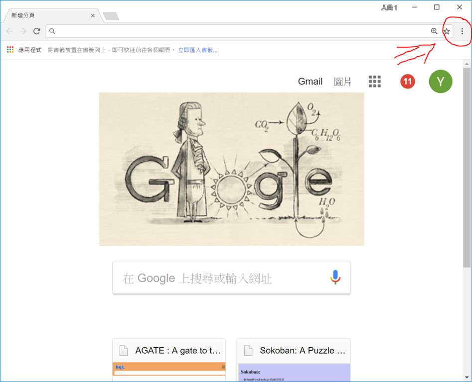
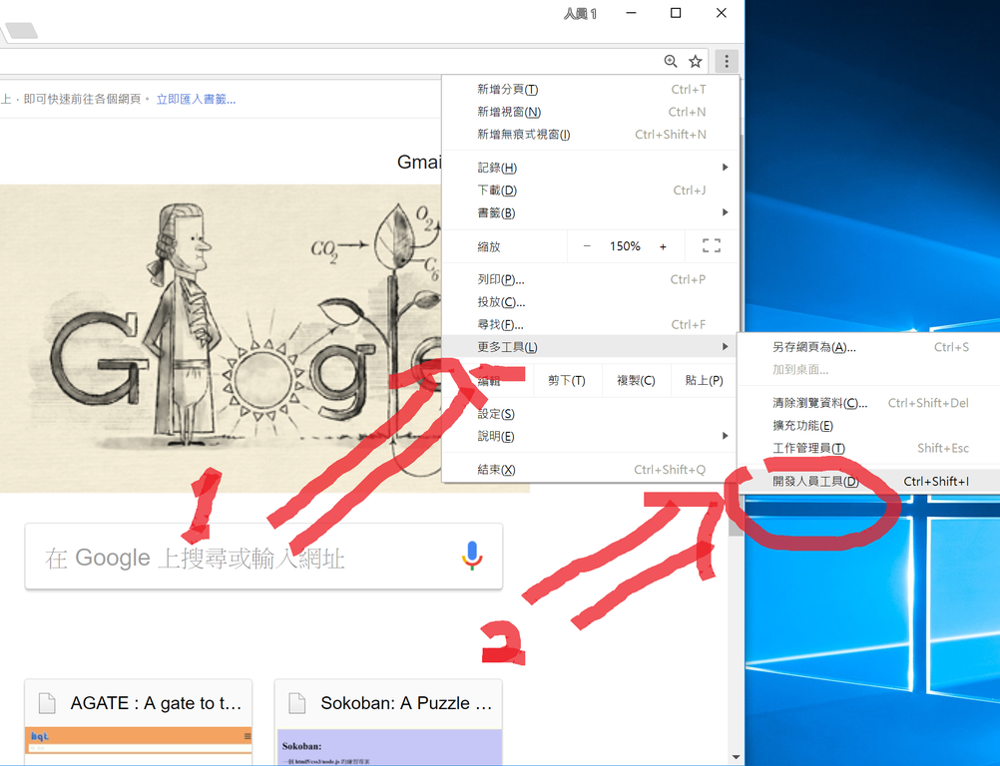
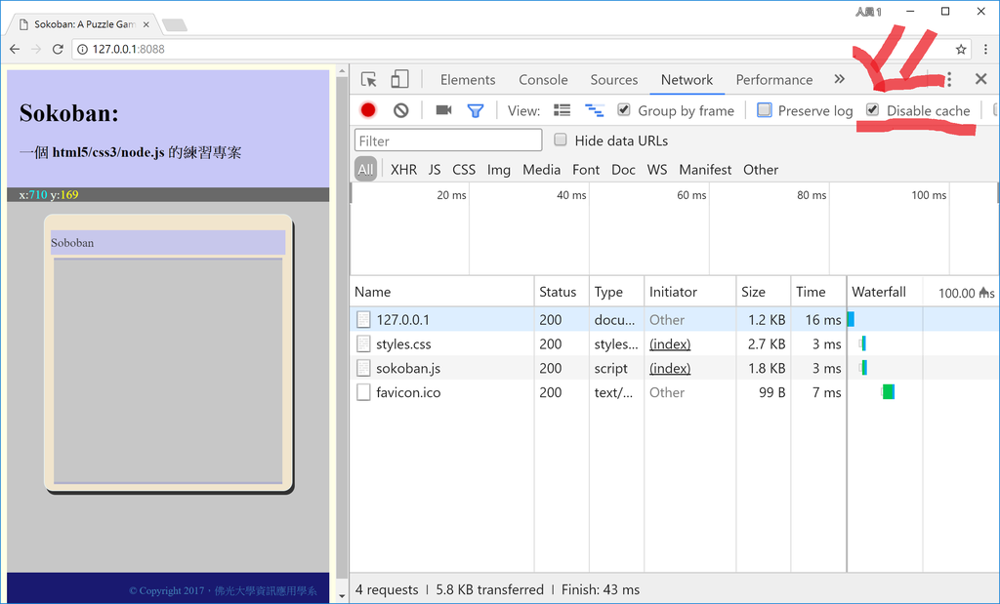
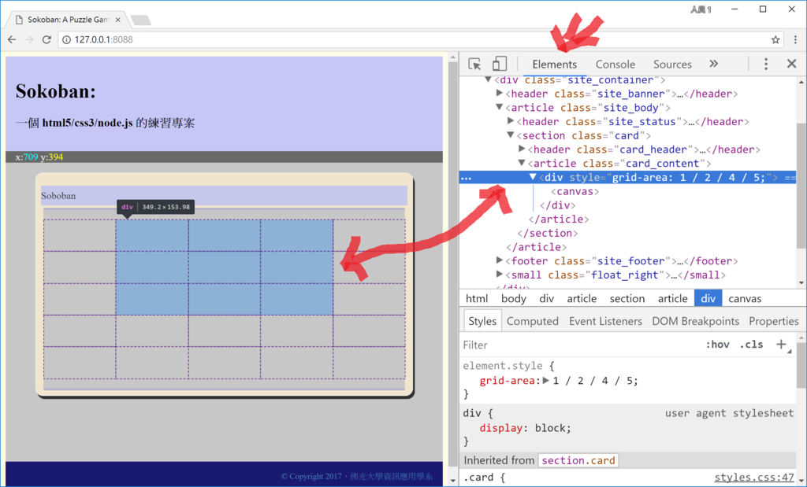
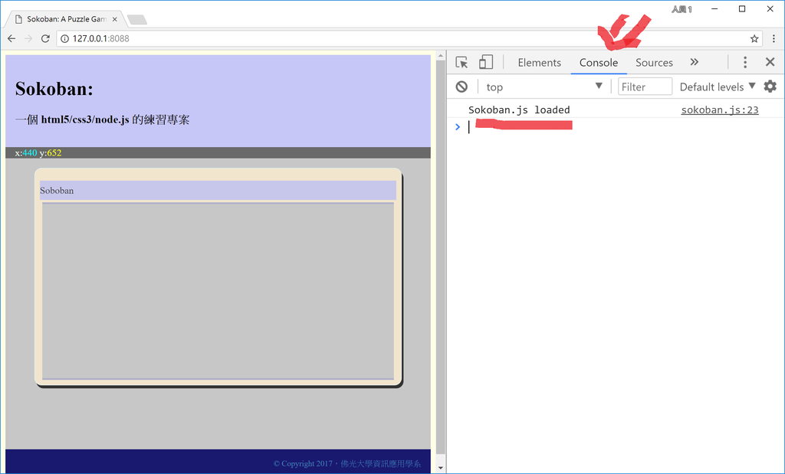
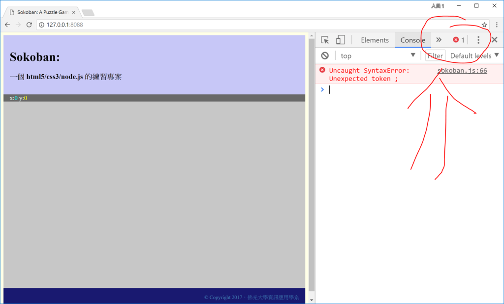
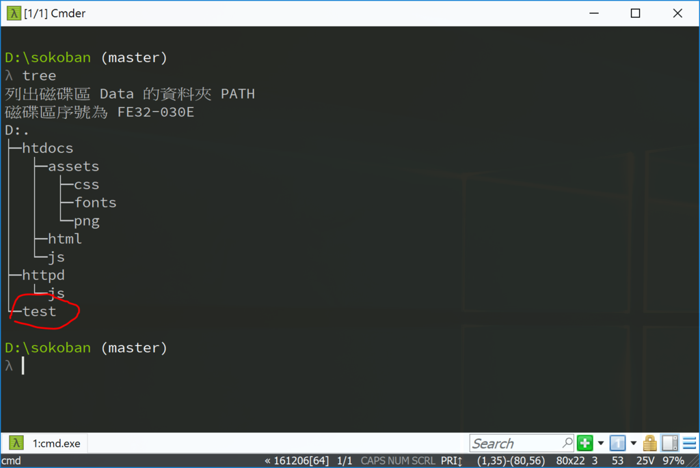
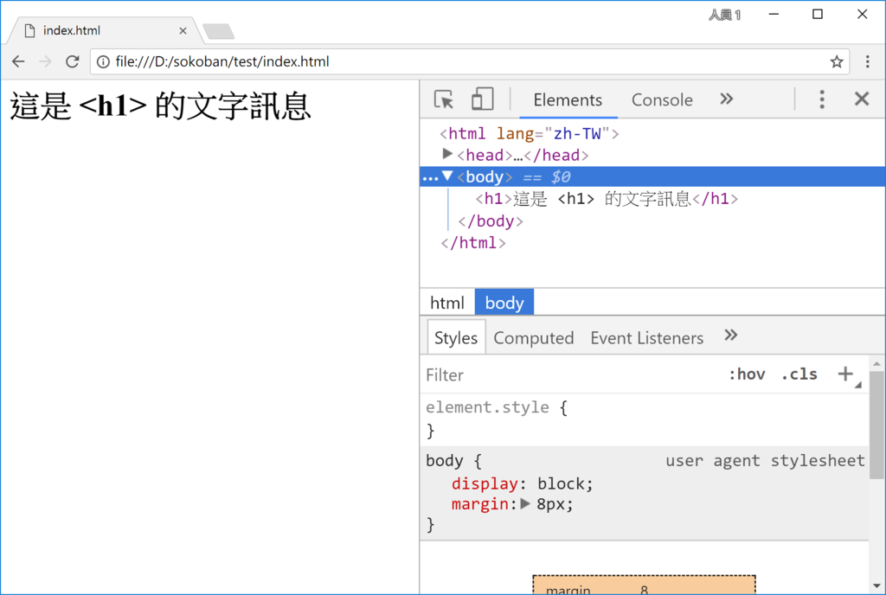

<!---
  @file       chapter_05.md
  @date       12/22/2017 created.
  @copyright  CC-BY, (C) 2017 Yiwei Chiao
  @detail
    This file is machine-generated. DONOT MODIFY IT DIRECTLY.
-->
# 導論

 程式開發過程裡一件最重要的事就是知道目前電腦裡發生了什麼事，程式設計師才能由此
 找出程式的錯誤或改變程式行為。

 現代的網頁瀏覽器，因為網頁應用程式的普及，也都內建了讓程式設計師了解網頁內部
 行為的工具，以協助網頁程式設計師完成工作。這裡以 Google [Chrome][chrome]
 為例，一窺瀏覽器在這個面向可以給我們什麼幫助。

 

## 專案準備

 為了了解 [Chrome][chrome] 的開發人員工具，請先準備好下面的檔案：

  * `index.html`: 放在 `sokoban/htdocs` 資料夾下。
  * `styles.css`: 放在 `sokoban/htdocs/asssets/css` 資料夾下。
  * `sokoban.js`: 放在 `sokoban/htdocs/js` 資料夾下。

 這三個檔案的作用：

  * `index.html`: 使用者瀏覽/網路爬蟲爬梳時，看到的網頁頁面。記錄了基本的
  網站資訊，如文字編碼，主題資訊等。也作為通知瀏覽器，後續 Web 資源，如
   `.js`，`.css` 等檔案的 `url` 資訊。
  * `styles.css`: 網頁的設計風格設定檔。網站的視覺風格由 `.css` 檔案決定。
  一個好的網站設計應該可以利用切換不同的 `.css` 檔作到不同的視覺呈現。
  * `sokoban.js`: [Sokoban][sokoban] 專案的客戶端程式。`.html` 提供了
  頁面的骨架，`.css` 為骨架加上了衣服，而 `.js` 是血肉。有了 `.js`，網頁才
  真正有了生命。

 三個檔案準備好了以後，啟動 `sokoban/httpd` 下的網頁伺服，可以準備來看看
 [Chrome][chrome] 的開發工具。

   

## [Chrome][chrome] 開發人員工具

 啟動 [Chrome][chrome] 瀏覽器，如圖 Figure \ref{chrome}，注意畫面右上角
 的按紐。那裡是開啓 [Chrome][chrome] ([Firefox][firefox] 也是) 瀏覽器
 設定的地方。

 打開後，如圖 Figure \ref{chrome:tool}，找到 \[開發人員工具\]，開啟它。
 開啟後，瀏覽器的畫面應該很類似圖 Figure \ref{chrome:debug_init} 的樣子。
 先如圖 Figure \ref{chrome:debug_init} 所示，找到 \[network\] 標籤下
 的 \[Disable Cache\] 將 [Chrome][chrome] 的**快取** (*cache*) 保持
 **關閉** (*disabled*)，以確保網頁開發過程中，瀏覽器執行的確定是最新修定的
 版本。

 同樣如圖 Figure \ref{chrome:debug_init} 所示， \[network\] 標籤下，
 可以看到瀏覽器和伺服器間的資料傳輸網路延遲等資訊，那些在開發大型網站應用作優
 化時是很重要的資訊。不過目前知道有它存在就好，暫時可以不用管它。

  

 將快取關閉後，就可以回頭來看最常接觸的兩個標籤：\[Elements\] 和 \[Console\] 了。

## [Chrome][chrome] \[Elements\] 標籤

 \[Elemtns\] 指得是 [HTML][mdnHTML5] 和 [CSS][mdnCSS]。在這個頁籤，可以
 看到\[開發人員工具\]上半部的畫面，顯示的是 [HTML][mdnHTML5] 的內容；而下半
 部則是 [CSS][mdnCSS] 的樣子。

  

 如圖 Figure \ref{chrome:debug_element} 所示，試著在\[Elements\]
 顯示的 [HTML][mdnHTML5] 標籤上移動滑鼠，可以注意到畫面左邊也有視覺變化的
 效果。那是 [Chrome][chrome] 在標示滑鼠所在的 [HTML][mdnHTML5] 標籤，
 在網頁上呈現的效果和範圍大小。

 所以，有這個頁面協助，設定 [HTML][mdnHTML5] 與 [CSS][mdnCSS] 就不用再憑空
 想像，而可以實時看到效果。

## [Chrome][chrome] \[Console\] 標籤

 在寫 [Node.js][nodejs] 程式時，可以利用 `console.log(...)` 在螢幕上輸出
 訊息以理解程式內部實際發生的事情；同樣的 `console.log(...)` 在瀏覽器裡，就是
 輸出到這個 \[Console\] 頁籤。

   

 可以打開 `sokoban/htdocs/js/index.js` 看到程式一開始就有一行 `console.log(...)`，和圖 Figure \ref{chrome:debug_console} 裡顯示的相同。

```javascript
window.addEventListener('load', () => {
  console.log('Sokoban.js loaded');
};
```

 而如果網頁程式執行有**錯誤**發生，[Chrome][chrome] 的 \[console\] 頁籤會
 如圖 Figure \ref{debug_error} 所顯示。右上角會有紅色的數字顯示程式中止前的
 錯誤個數；而 \[Console\] 視窗則會顯示出錯的程式碼和它的 `.js` 檔名與行號。

   

## 問題與練習

 1. 在 \[Elements\] 裡移動滑鼠游標，嘗試理解它的顯示和作用。
 1. 利用文字編輯器 (如 `atom`)，打開 `htdocs/index.html` 比較它的內容和
  \[Elements\] 顯示的內容。好像有些不大一樣？將 `htdocs/js/index.js` 裡
  `console.log(...)` 後的內容都註解掉，再比對看看內容是否相同？研究一下？

[firefox]: https://www.mozilla.org/zh-TW/firefox/
[mdnCSS]: https://developer.mozilla.org/en-US/docs/Web/CSS  

<!-- intro.md -->

# [DOM][mdnDOM] (Data Object Model) 背景

 要寫作網頁應用程式 (`WebApp`)，在客戶端 (網頁瀏覽器) 有三大支柱：
  * [HTML][mdnHTML5]：負責**文件** (*Document*) 結構
  * [CSS][mdnCSS]：負責**文件**排版
  * [JavaScript][mdnJavaScript]：負責**文作**操作 (*manipulate*)
 一個有趣的問題就出現了。[HTML][mdnHTML5] 和 [CSS][mdnCSS] 都是簡單的文字
 檔案。[JavaScript][mdnJavaScript] (或任何其它程式語言) 當然可以將它們當作
 **文字** (*text*)，或說**字串** (*string*) 來處理。事實上，在伺服端 (網頁
 伺服器)，所謂的**後台** (或稱**後端**，*backend*) 程式，如 [PHP][]，
 [JSP][wikiJSP]，[Python][]，[Ruby][] 等開發工具就是這麼作的。甚至還開發了
 專門的**樣本語言** ([*template engine*][wikiTemplateEngine]) 來作這件
 事。例如，給 [Node.js][nodejs] 用的 [Jade][jade]，[Python][]
 的 [Jinja2][jinja]，[Ruby][] 內建的 [ERB][wikiERuby]，[PHP][]
 的 [Twig][twig] 等。

 但是，現在是在**前端** (或稱 **前台**，*frontend*)；無論是
 [HTML][mdnHTML5] 或 [CSS][mdnCSS] 都己經 (也必需) 分析轉換成瀏覽器的
 **內部** (*internal*) 表示型式。所以在前端最好的方式應該是直接和瀏覽器溝通。
 直接操作解譯過的 [HTML][mdnHTML5] 物件。

 這個讓外部程式可以直接操縱瀏覽器解譯後的 [HTML][mdnHTML5]，[CSS][mdnCSS]
 物件的標準，就是 [DOM][mdnDOM] 應用程式介面 (api)。

## [DOM][mdnDOM] 簡介

 [DOM][mdnDOM] 全稱是 *`Data Object Model`^ (**資料物件模型**)；設計用來
 處理和表示 [HTML][mdnHTML]，[SVG][mdnSVG] 和 [XML][mdnXML] 文件的
 Web 公開標準。

 [DOM][mdnDOM] 背後的骨幹概念很簡單而直覺。[DOM][mdnDOM] 將文件視為一個
 **樹** (*tree*)，文件內的結構則視作樹的**分支** (*branch*)，最後的內容，
 自然是**樹葉** (*leaf*)，稱作**節點** (*node*)。因為 [DOM][mdnDOM] 將
 文件視為一棵樹，所以後面會用 **[DOM][mdnDOM] 樹** 或 *[DOM][mdnDOM]
 tree* 也稱呼某個 [HTML][mdnHTML5] 文件的 [DOM][mdnDOM] 型式。

## [DOM][mdnDOM] 和 [HTML][mdnHTML] 文件

一個簡單的例子，考慮下面這個簡單的 `.html` 檔案:

```html
<html>
  <body>
    Hello World!
  </body>
</html>
```
  以 [DOM][mdnDOM] 模型來表示，大概長成這樣：

```
window.document
  |
  + body  
  |   |
  .   TextNode
  .
```  

 和原來的 [HTML][mdnHTML] 對照，應該可以看到明確的一一對應。而上面列表中的
 `window.document` 就是 [JavaScript][mdnJavaScript] 在處理網頁文件時
 的**根** (*root*) 物件。其中的 `window` 代表的是瀏覽器視窗 (viewport)；
 是真正的**瀏覽器物件**；也就是說，`window` **不是** [HTML][mdnHTML5]
 物件的一部份，它的存在是作為一個容器，將瀏覽器和外來的 [HTML][mdnHTML5]
 文件結合在一起，就是 `window.document` 這個**屬性**裡存放的物件才是真正
 [HTML][mdnHTML5] 文件。一般在 [JavaScript][mdnJavaScript] 裡，可以
 直接寫 `document` 來存取它的方法。

## [DOM][mdnDOM] 和**物件導向** (*Object-Orient*)

 上面的對應還透露了另一個關鍵的**概念** (concept) 問題。**物件導向**
 (Object-Orient) 程式裡，程式碼被分隔成一個個的**物件** (*object*)。程式
 的**資料** (*data*) 由物件的**屬性** (attribute/property) 表達；操作
 資料的**函數** (*function*) 則由物件的**方法** (*method*) 來記錄。

 對應到 [DOM][mdnDOM] 模型，延續上面的例子，`document` 是 `window` 物件
 的屬性，寫成 `window.document`；而 `body` 是 [DOM][mdnDOM] tree 裡
 `window.document` 的**子節點** (*child node*)，換回物件導向模型，它就是
 `document` 物件裡的一個 `body` **屬性** (*attribute/property*)。在
 [JavaScript][mdnJavaScirpt] 裡，透過 `document.body` 來存取。

 換句話說，物件導向裡的 **物件 - 屬性** (*Object - Attribute*) 關係，
 對應到 [DOM][mdnDOM] 裡的 **親節點 - 子節點**
 (*Parent Node - Child Node*) 關係。

 理解這一點，就可以很容易的理解 [DOM][mdnDOM] APIs，同時利用它來操作
 [HTML][mdnHTML5] 文件來達到 WebApp 的要求了。

## [DOM][mdnDOM] 實作練習

 來試試 [DOM][mdnDOM] 的實際操作。先在專案裡建立一個**測試** (*test*) 資料夾，如圖 \ref{folder_test}：

  

 將下面的程式碼放到 `test/index.html`：

```html
 1. <html lang="zh-TW">
 2.   <head>
 3.     <meta charset="utf-8">
 4.     <script src="index.js"></script>
 5.   </head>
 6.   <body>
 7.   </body>
 8. </html>
```

 再將下面的程式碼放到 `test/index.js`：

```javascript
 1. 'use strict';

 2. window.addEventListener('load', () => {
 3.   console.log("index.js loaded");
 4.
 5.   let h1 = document.createElement('h1');
 6.   let msg = document.createTextNode('這是 <h1> 的文字訊息');
 7.
 8.   h1.appendChild(msg);
 9.
10.   document.body.appendChild(h1);
11. });
```
 利用 [Chrome][chrome] (或 [Firefox][firefox]) 打開
 `file:///d:/sokoban/test/index.html` (記得將前面的網址修改成適合當下電腦
 配置。) 應該會看到類似圖 \ref{dom_test} 的畫面。

  

 回頭看 `index.html` 的源碼，應該可以看到它原來應該是一個空白的網頁；或者，可以將 `index.html` 的第四 (4) 行 (載入 `.js` 檔案那行) 改成如下的型式：

```html
 4.     <!--script src="index.js"></script-->
```

 也就將第四 (4) 行**註解** (*comment*) 掉。再載入一次，看到的應該是空白畫面。
 因為畫面上的訊息是由 `index.js` 裡的 [JavaScript][mdnJavaScirpt] 直接
 操作 [DOM][mdnDOM] tree 產生的。所以如果將載入 `index.js` 的源碼註解掉，
 程式沒載入，畫面自然回到空白的狀態。

## `document.createElement(...)`，`document.appendChild(...)`

 `index.js` 裡只用了兩 (2) 個 [DOM][mdnDOM] 的方法：

 * `createElement(tag)`：建立一個 [HTML][mdnHTML5] 標籤名稱為 `tag` 的
 元素節點。`tag` 的型別是**字串** (*string*。)；傳回值是一個 [DOM][mdnDOM]
 的**節點** (*node*) 物件。
 * `appendChild(node)`：將 [DOM][mdnDOM] 的 `node` 物件插入到
 [DOM][mdnDOM] 樹中作為呼叫元素的**子節點** (*child node*)。

 所以 `createElement` 是**建立** (*create*) 新節點；而 `appendChild` 是
 將節點**插入** (*insert*) 到 [DOM][mdnDOM] 裡的特定位置。因為瀏覽器只會
 **顯示** (*render*) `window.document` 裡的 [DOM][mdnDOM] tree；所以，
 雖然理論上，可以產生多個不同的 [DOM][domDOM] tree，但**只有**接到
 `window.document` 的那棵 [DOM][mdnDOM] 樹，才會被使用者看到。利用這點，
 可以作出多變的 *WebApp*。

## 思考與練習

 * 對 [DOM][mdnDOM] 的操作有基本概念了，範例程式介紹的是 `<h1>`；試試再加上
 幾個，如 `<h2>` 或 `<h6>` 的訊息。
  * 作上面的練習時，觀察一下瀏覽器除錯視窗 `Element` 窗口的訊息變化。
  * 查一下網路資訊，找找如何由 [DOM][mdnDOM] tree 裡：
    + 移除一個節點
    + 將某個節點由當位置搬到新位置。

[firefox]: https://www.mozilla.org/zh-TW/firefox/
[jade]: http://jade-lang.com/
[jinja]: http://jinja.pocoo.org/
[PHP]: https://secure.php.net/
[Python]: https://www.python.org/
[Ruby]: https://www.ruby-lang.org/zh_tw/
[twig]: https://twig.symfony.com/

<!-- intro.md -->

# [Canvas][mdnCanvas] 繪圖

```javascript
'use strict';

/**
 * sokoban 關卡描述
 *
 *  #    牆壁 (wall)
 *  @    玩家 (player)
 *  $    箱子 (box)
 *  .    目標點 (goal)
 *  +    玩家站在目標點上 (player on goal square)
 *  *    箱子在目標點上 (box on goal square)
 *  空白 地板 (floor)
 */
let levels = {
  'level_0': [
    "############",
    "#         .#",
    "#          #",
    "#          #",
    "#   ####   #",
    "#          #",
    "#          #",
    "#    $     #",
    "#    @     #",
    "#          #",
    "#          #",
    "############"
  ],

  'level_1': [
     "------------",
     "------------",
     "--#######---",
     "--# ..$ #---",
     "--# # $ #---",
     "--# # # #---",
     "--# $@# #---",
     "--#.$   #---",
     "--#.#####---",
     "--###-------",
     "------------",
     "------------"
   ],
};

/**
 * 準備繪圖用的 sprites。
 *
 * @returns sprites 集合物件。
 */
let sprites = ((spriteSheet) => {
  let baseX = 0;
  let baseY = 6 * 64;

  let tileset = new Image();
  tileset.src = spriteSheet;

  let tile = (tileset, sx, sy, ctx) => {
    ctx.drawImage(
      tileset,
      sx, sy, 32, 32,
      0, 0, 32, 32
    );
  };

  return {
    box: tile.bind(null, tileset, baseX, baseY),
    boxOnGoal: tile.bind(null, tileset, baseX + 32, baseY),
    wall: tile.bind(null, tileset, baseX + 64, baseY),

    floor: tile.bind(null, tileset, baseX, baseY + 32),
    goal: tile.bind(null, tileset, baseX + 32, baseY + 32),
    grass: tile.bind(null, tileset, baseX + 64, baseY + 32),

    faceRight: tile.bind(null, tileset, baseX, baseY + 64),
    faceDown: tile.bind(null, tileset, baseX + 32, baseY + 64),

    faceUp: tile.bind(null, tileset, baseX, baseY + 96),
    faceLeft: tile.bind(null, tileset, baseX + 32, baseY + 96),
  };
})('SokobanClone_byVellidragon.png');

/**
 * 依遊戲狀態，繪出盤面
 *
 * @param 'ctx' : 繪圖 context 物件
 * @returns {undefined}
 */
let drawGameBoard = (ctx, gameState) => {
  let height = gameState.level.length;

  for (let x = 0; x < height; x ++) {
    for (let y = 0; y < height; y ++) {
      ctx.save();
      ctx.translate(32*x, 32*y);

      switch (gameState.level[y].charAt(x)) {
        case '#': 
          sprites.wall(ctx);

          break;

        case '$': 
          sprites.box(ctx);

          break;

        case '@':
          sprites.floor(ctx);
          sprites.faceUp(ctx);

          break;

        case ' ':
          sprites.floor(ctx);

          break;

        case '.':
          sprites.goal(ctx);

          break;

        case'*':
          sprites.boxOnGoal(ctx);

          break;

        case'+':
          sprites.goal(ctx);
          sprites.faceUp(ctx);

          break;

        case'-':
          sprites.grass(ctx);

          break;

        default:
          console.log('Wrong map data');
      }

      ctx.restore();
    };
  };
};

/**
 * sokoban 程式進入點
 *
 * @callback
 * @param 'load' : DOM 事件名
 * @returns {undefined}
 */
window.addEventListener('load', () => {
  console.log("Sokoban.js loaded");

  let gameTitle = document.createElement('span');
  gameTitle.textContent = 'Sokoban';

  let gameHeader = document.createElement('header');
  gameHeader.className = 'card_header';

  gameHeader.appendChild(gameTitle);

  let sokobanCanvas = document.createElement('canvas');
  let ctxPaint = sokobanCanvas.getContext('2d');

  // 設定繪圖圖紙的寬高
  sokobanCanvas.width = 32*12
  sokobanCanvas.height = 32*12;

  // 將圖紙埴滿背景色
  ctxPaint.fillStyle = 'mintcream';
  ctxPaint.fillRect(0, 0, sokobanCanvas.width, sokobanCanvas.height);

  // 準備一支可以畫 _斷續線_ 的畫筆
  ctxPaint.strokeStyle = 'black';
  // 斷續線由連續 4px，再空白 4px構成
  ctxPaint.setLineDash([4, 4]);

  // 開始記録格線的 paths
  ctxPaint.beginPath();

  // 畫 12 條鉛直斷續線
  for (var c = 1; c < 12; c ++) {
    ctxPaint.moveTo(c * 32, 0);
    ctxPaint.lineTo(c * 32, 32*12);
  }

  // 畫 12 條水平斷續線
  for (var r = 1; r < 12; r ++) {
    ctxPaint.moveTo( 0, r * 32);
    ctxPaint.lineTo(640, r * 32);
  }

  // 繪出格線
  ctxPaint.stroke();       

  let sokobanBoard = document.createElement('div');
  sokobanBoard.style.gridArea = '1 / 2 / 4 / 5';

  sokobanBoard.appendChild(sokobanCanvas);

  let gameBoard = document.createElement('article');
  gameBoard.className = 'card_content';

  gameBoard.appendChild(sokobanBoard);

  let gameDesktop = document.createElement('section');
  gameDesktop.className = 'card';

  gameDesktop.appendChild(gameHeader);
  gameDesktop.appendChild(gameBoard);

  let desktop = document.querySelector('.site_body')
  desktop.appendChild(gameDesktop);

  /**
   * 滑鼠游標移動追踪
   *
   * @callback
   * @param 'mousemove' : DOM 事件名
   * @param e : DOM event 物件
   * @returns {undefined}
   */
  desktop.addEventListener('mousemove', (e) => {
    document.getElementById('cursor_x').textContent = e.clientX;
    document.getElementById('cursor_y').textContent = e.clientY;
  });

  drawGameBoard(ctxPaint, { level: levels.level_0 });
});
```

[firefox]: https://www.mozilla.org/zh-TW/firefox/
[jade]: http://jade-lang.com/
[jinja]: http://jinja.pocoo.org/
[PHP]: https://secure.php.net/
[Python]: https://www.python.org/
[Ruby]: https://www.ruby-lang.org/zh_tw/
[twig]: https://twig.symfony.com/

<!-- intro.md -->

[android]: https://developer.android.com
[ECMAScript]: https://www.ecma-international.org/publications/standards/Ecma-262.htm
[nodejs]: https://nodejs.org
[sokoban]: https://en.wikipedia.org/wiki/Sokoban
[sokobanjs]: https://github.com/ywchiao/sokoban.js.git
[sokoban.android]: https://github.com/ywchiao/sokoban
[atom]: https://atom.io
[babeljs]: https://babeljs.io
[browserify]: http://browserify.org
[git]: https://git-scm.com
[github]: https://github.com
[ide]: https://en.wikipedia.org/wiki/Integrated_development_environment
[rollupjs]: https://rollupjs.org
[torvalds]: https://en.wikipedia.org/wiki/Linus_Torvalds
[typescript]: https://www.typescriptlang.org
[uglifyjs]: https://github.com/mishoo/UglifyJS2
[vcs]: https://en.wikipedia.org/wiki/Version_control
[vscode]: https://github.com/Microsoft/vscode
[webpack]: https://webpack.github.io
[brew]: https://github.com/Homebrew/brew
[cli]: https://en.wikipedia.org/wiki/Command-line_interface
[cmder]: https://github.com/cmderdev/cmder
[gui]: https://en.wikipedia.org/wiki/Graphical_user_interface
[npm]: https://www.npmjs.com
[nvm]: https://github.com/creationix/nvm
[vim]: https://vim.sourceforge.io
[xcode]: https://developer.apple.com/xcode
[commonmark]: http://commonmark.org
[gfm]: https://github.github.com/gfm
[gitignore]: https://git-scm.com/docs/gitignore
[markdown]: https://en.wikipedia.org/wiki/Markdown
[MIT]: https://opensource.org/licenses/MIT
[scriptingLanguage]: https://en.wikipedia.org/wiki/Scripting_language
[shellScript]: https://en.wikipedia.org/wiki/Shell_script
[sokoban.js]: https://github.com/ywchiao/sokoban.js.git
[amd]: http://requirejs.org/docs/whyamd.html
[arrowfunction]: https://developer.mozilla.org/zh-TW/docs/Web/JavaScript/Reference/Functions/Arrow_functions
[clientrequest]: https://nodejs.org/api/http.html#http_class_http_clientrequest
[closure]: https://developer.mozilla.org/zh-TW/docs/Web/JavaScript/Closures
[commonjs]: http://www.commonjs.org
[console]: https://nodejs.org/api/console.html#console_class_console
[createserver]: https://nodejs.org/api/http.html#http_http_createserver_requestlistener
[http]: https://en.wikipedia.org/wiki/Hypertext_Transfer_Protocol
[httpmod]: https://nodejs.org/api/http.html#http_http
[httpserver]: https://nodejs.org/api/http.html#http_class_http_server
[iife]: https://en.wikipedia.org/wiki/Immediately-invoked_function_expression
[JavaScript]: https://developer.mozilla.org/zh-TW/docs/Web/JavaScript
[let]: https://developer.mozilla.org/zh-TW/docs/Web/JavaScript/Reference/Statements/let
[mdn]: https://developer.mozilla.org/zh-TW
[mime]: https://developer.mozilla.org/en-US/docs/Web/HTTP/Basics_of_HTTP/MIME_types
[require]: https://nodejs.org/api/modules.html#modules_require
[responseend]: https://nodejs.org/api/http.html#http_response_end_data_encoding_callback
[responsewrite]: https://nodejs.org/api/http.html#http_response_write_chunk_encoding_callback
[responsewritehead]: https://nodejs.org/api/http.html#http_response_writehead_statuscode_statusmessage_headers
[serverlisten]: https://nodejs.org/api/http.html#http_server_listen_port_hostname_backlog_callback
[serverresponse]: https://nodejs.org/api/http.html#http_class_http_serverresponse
[strict]: https://developer.mozilla.org/en-US/docs/Web/JavaScript/Reference/Strict_mode
[var]: https://developer.mozilla.org/zh-TW/docs/Web/JavaScript/Reference/Statements/var
[Unicode]: https://zh.wikipedia.org/wiki/Unicode
[utf8]: https://zh.wikipedia.org/wiki/UTF-8
[mdnCSS]: https://developer.mozilla.org/en-US/docs/Web/CSS
[mdnHTML]: https://developer.mozilla.org/en-US/docs/Web/HTML
[mdnJavaScript]: https://developer.mozilla.org/zh-TW/docs/Web/JavaScript
[wikiCSS]: https://en.wikipedia.org/wiki/Cascading_Style_Sheets
[wikiECMAScript]: https://en.wikipedia.org/wiki/ECMAScript
[wikiHTML]: https://en.wikipedia.org/wiki/HTML
[API]: https://en.wikipedia.org/wiki/Application_programming_interface
[fs]: https://nodejs.org/api/fs.html#fs_file_system
[readfile]: https://nodejs.org/api/fs.html#fs_fs_readfile_path_options_callback
[readfilesync]: https://nodejs.org/api/fs.html#fs_fs_readfilesync_path_options
[githubHead]: https://github.com/joshbuchea/HEAD
[mdnHTML5]: https://developer.mozilla.org/en-US/docs/Web/Guide/HTML/HTML5
[wikiMarkdown]: https://en.wikipedia.org/wiki/Markdown
[wikiMarkupLang]: https://en.wikipedia.org/wiki/Markup_language
[wikiMetadata]: https://en.wikipedia.org/wiki/Metadata
[wikiProgLang]: https://en.wikipedia.org/wiki/Programming_language
[wikiXML]: https://en.wikipedia.org/wiki/XML
[wikiYAML]: https://en.wikipedia.org/wiki/YAML
[sokoban.tiles]: https://opengameart.org/content/sokoban-clone-tiles
[http_inmsg]: https://nodejs.org/api/http.html#http_class_http_incomingmessage
[chrome]: https://www.google.com.tw/chrome
[mdnDOM]: https://developer.mozilla.org/en-US/docs/Web/API/Document_Object_Model
[mdnSVG]: https://developer.mozilla.org/zh-TW/docs/Web/SVG
[mdnXML]: https://developer.mozilla.org/en-US/docs/XML_introduction
[wikiERuby]: https://en.wikipedia.org/wiki/ERuby
[wikiJSP]: https://en.wikipedia.org/wiki/JavaServer_Pages
[wikiTemplatEngine]: https://en.wikipedia.org/wiki/Template_processor
[mdnCanvas]: https://developer.mozilla.org/zh-TW/docs/Web/API/Canvas_API
[^android]: https://developer.android.com
[^ECMAScript]: https://en.wikipedia.org/wiki/ECMAScript
[^nodejs]: https://nodejs.org
[^sokoban]: https://en.wikipedia.org/wiki/Sokoban
[^sokobanjs]: https://github.com/ywchiao/sokobna.js
[^sokoban.android]: https://github.com/ywchiao/sokoban
[^atom]: https://atom.io
[^babeljs]: https://babeljs.io
[^browserify]: http://browserify.org
[^git]: https://git-scm.com
[^github]: https://github.com
[^ide]: https://en.wikipedia.org/wiki/Integrated_development_environment
[^rollupjs]: https://rollupjs.org
[^torvalds]: https://en.wikipedia.org/wiki/Linus_Torvalds
[^typescript]: https://www.typescriptlang.org
[^uglifyjs]: https://github.com/mishoo/UglifyJS2
[^vcs]: https://en.wikipedia.org/wiki/Version_control
[^vscode]: https://github.com/Microsoft/vscode
[^webpack]: https://webpack.github.io
[^brew]: https://github.com/Homebrew/brew
[^cli]: https://en.wikipedia.org/wiki/Command-line_interface
[^cmder]: https://github.com/cmderdev/cmder
[^gui]: https://en.wikipedia.org/wiki/Graphical_user_interface
[^npm]: https://www.npmjs.com
[^nvm]: https://github.com/creationix/nvm
[^vim]: https://vim.sourceforge.io
[^xcode]: https://developer.apple.com/xcode
[^commonmark]: http://commonmark.org
[^gfm]: https://github.github.com/gfm
[^gitignore]: https://git-scm.com/docs/gitignore
[^markdown]: https://en.wikipedia.org/wiki/Markdown
[^MIT]: https://opensource.org/licenses/MIT

<!--- chapter_05.md -->