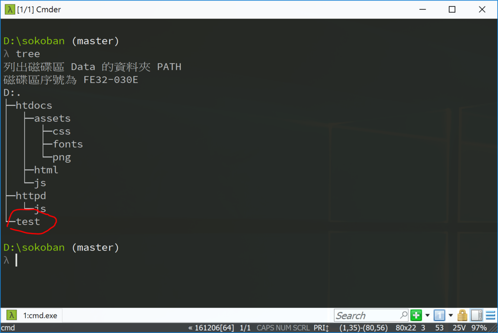
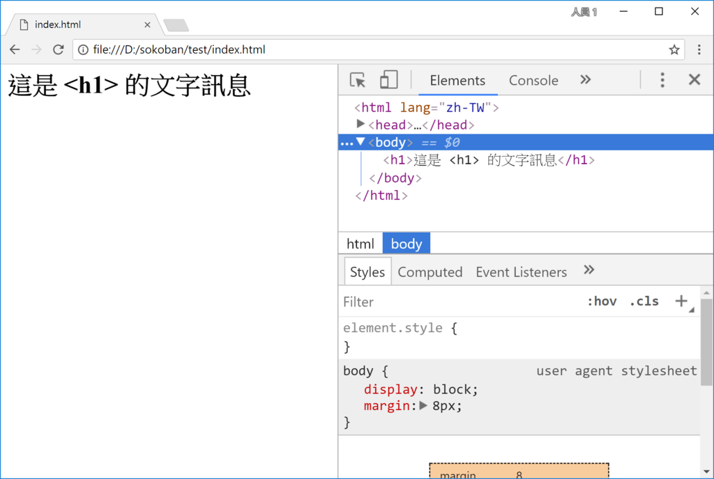

<!---
  @file       intro.md
  @author     Yiwei Chiao (ywchiao@gmail.com)
  @date       12/15/2017 created.
  @date       12/15/2017 last modified.
  @version    0.1.0
  @copyright  CC-BY, (C) 2017 Yiwei Chiao
-->

# [DOM][mdnDOM] (Data Object Model) 背景

 要寫作網頁應用程式 (`WebApp`)，在客戶端 (網頁瀏覽器) 有三大支柱：
  * [HTML][mdnHTML5]：負責**文件** (*Document*) 結構
  * [CSS][mdnCSS]：負責**文件**排版
  * [JavaScript][mdnJavaScript]：負責**文作**操作 (*manipulate*)
 一個有趣的問題就出現了。[HTML][mdnHTML5] 和 [CSS][mdnCSS] 都是簡單的文字
 檔案。[JavaScript][mdnJavaScript] (或任何其它程式語言) 當然可以將它們當作
 **文字** (*text*)，或說**字串** (*string*) 來處理。事實上，在伺服端 (網頁
 伺服器)，所謂的**後台** (或稱**後端**，*backend*) 程式，如 [PHP][]，
 [JSP][wikiJSP]，[Python][]，[Ruby][] 等開發工具就是這麼作的。甚至還開發了
 專門的**樣本語言** ([*template engine*][wikiTemplateEngine]) 來作這件
 事。例如，給 [Node.js][nodejs] 用的 [Jade][jade]，[Python][]
 的 [Jinja2][jinja]，[Ruby][] 內建的 [ERB][wikiERuby]，[PHP][]
 的 [Twig][twig] 等。

 但是，現在是在**前端** (或稱 **前台**，*frontend*)；無論是
 [HTML][mdnHTML5] 或 [CSS][mdnCSS] 都己經 (也必需) 分析轉換成瀏覽器的
 **內部** (*internal*) 表示型式。所以在前端最好的方式應該是直接和瀏覽器溝通。
 直接操作解譯過的 [HTML][mdnHTML5] 物件。

 這個讓外部程式可以直接操縱瀏覽器解譯後的 [HTML][mdnHTML5]，[CSS][mdnCSS]
 物件的標準，就是 [DOM][mdnDOM] 應用程式介面 (api)。

## [DOM][mdnDOM] 簡介

 [DOM][mdnDOM] 全稱是 *`Data Object Model`^ (**資料物件模型**)；設計用來
 處理和表示 [HTML][mdnHTML]，[SVG][mdnSVG] 和 [XML][mdnXML] 文件的
 Web 公開標準。

 [DOM][mdnDOM] 背後的骨幹概念很簡單而直覺。[DOM][mdnDOM] 將文件視為一個
 **樹** (*tree*)，文件內的結構則視作樹的**分支** (*branch*)，最後的內容，
 自然是**樹葉** (*leaf*)，稱作**節點** (*node*)。因為 [DOM][mdnDOM] 將
 文件視為一棵樹，所以後面會用 **[DOM][mdnDOM] 樹** 或 *[DOM][mdnDOM]
 tree* 也稱呼某個 [HTML][mdnHTML5] 文件的 [DOM][mdnDOM] 型式。

## [DOM][mdnDOM] 和 [HTML][mdnHTML] 文件

一個簡單的例子，考慮下面這個簡單的 `.html` 檔案:

```html
<html>
  <body>
    Hello World!
  </body>
</html>
```
  以 [DOM][mdnDOM] 模型來表示，大概長成這樣：

```
window.document
  |
  + body  
  |   |
  .   TextNode
  .
```  

 和原來的 [HTML][mdnHTML] 對照，應該可以看到明確的一一對應。而上面列表中的
 `window.document` 就是 [JavaScript][mdnJavaScript] 在處理網頁文件時
 的**根** (*root*) 物件。其中的 `window` 代表的是瀏覽器視窗 (viewport)；
 是真正的**瀏覽器物件**；也就是說，`window` **不是** [HTML][mdnHTML5]
 物件的一部份，它的存在是作為一個容器，將瀏覽器和外來的 [HTML][mdnHTML5]
 文件結合在一起，就是 `window.document` 這個**屬性**裡存放的物件才是真正
 [HTML][mdnHTML5] 文件。一般在 [JavaScript][mdnJavaScript] 裡，可以
 直接寫 `document` 來存取它的方法。

## [DOM][mdnDOM] 和**物件導向** (*Object-Orient*)

 上面的對應還透露了另一個關鍵的**概念** (concept) 問題。**物件導向**
 (Object-Orient) 程式裡，程式碼被分隔成一個個的**物件** (*object*)。程式
 的**資料** (*data*) 由物件的**屬性** (attribute/property) 表達；操作
 資料的**函數** (*function*) 則由物件的**方法** (*method*) 來記錄。

 對應到 [DOM][mdnDOM] 模型，延續上面的例子，`document` 是 `window` 物件
 的屬性，寫成 `window.document`；而 `body` 是 [DOM][mdnDOM] tree 裡
 `window.document` 的**子節點** (*child node*)，換回物件導向模型，它就是
 `document` 物件裡的一個 `body` **屬性** (*attribute/property*)。在
 [JavaScript][mdnJavaScirpt] 裡，透過 `document.body` 來存取。

 換句話說，物件導向裡的 **物件 - 屬性** (*Object - Attribute*) 關係，
 對應到 [DOM][mdnDOM] 裡的 **親節點 - 子節點**
 (*Parent Node - Child Node*) 關係。

 理解這一點，就可以很容易的理解 [DOM][mdnDOM] APIs，同時利用它來操作
 [HTML][mdnHTML5] 文件來達到 WebApp 的要求了。

## [DOM][mdnDOM] 實作練習

 來試試 [DOM][mdnDOM] 的實際操作。先在專案裡建立一個**測試** (*test*) 資料夾，如圖 \ref{folder_test}：

  

 將下面的程式碼放到 `test/index.html`：

```html
 1. <html lang="zh-TW">
 2.   <head>
 3.     <meta charset="utf-8">
 4.     <script src="index.js"></script>
 5.   </head>
 6.   <body>
 7.   </body>
 8. </html>
```

 再將下面的程式碼放到 `test/index.js`：

```javascript
 1. 'use strict';

 2. window.addEventListener('load', () => {
 3.   console.log("index.js loaded");
 4.
 5.   let h1 = document.createElement('h1');
 6.   let msg = document.createTextNode('這是 <h1> 的文字訊息');
 7.
 8.   h1.appendChild(msg);
 9.
10.   document.body.appendChild(h1);
11. });
```
 利用 [Chrome][chrome] (或 [Firefox][firefox]) 打開
 `file:///d:/sokoban/test/index.html` (記得將前面的網址修改成適合當下電腦
 配置。) 應該會看到類似圖 \ref{dom_test} 的畫面。

  

 回頭看 `index.html` 的源碼，應該可以看到它原來應該是一個空白的網頁；或者，可以將 `index.html` 的第四 (4) 行 (載入 `.js` 檔案那行) 改成如下的型式：

```html
 4.     <!--script src="index.js"></script-->
```

 也就將第四 (4) 行**註解** (*comment*) 掉。再載入一次，看到的應該是空白畫面。
 因為畫面上的訊息是由 `index.js` 裡的 [JavaScript][mdnJavaScirpt] 直接
 操作 [DOM][mdnDOM] tree 產生的。所以如果將載入 `index.js` 的源碼註解掉，
 程式沒載入，畫面自然回到空白的狀態。

## `document.createElement(...)`，`document.appendChild(...)`

 `index.js` 裡只用了兩 (2) 個 [DOM][mdnDOM] 的方法：

 * `createElement(tag)`：建立一個 [HTML][mdnHTML5] 標籤名稱為 `tag` 的
 元素節點。`tag` 的型別是**字串** (*string*。)；傳回值是一個 [DOM][mdnDOM]
 的**節點** (*node*) 物件。
 * `appendChild(node)`：將 [DOM][mdnDOM] 的 `node` 物件插入到
 [DOM][mdnDOM] 樹中作為呼叫元素的**子節點** (*child node*)。

 所以 `createElement` 是**建立** (*create*) 新節點；而 `appendChild` 是
 將節點**插入** (*insert*) 到 [DOM][mdnDOM] 裡的特定位置。因為瀏覽器只會
 **顯示** (*render*) `window.document` 裡的 [DOM][mdnDOM] tree；所以，
 雖然理論上，可以產生多個不同的 [DOM][domDOM] tree，但**只有**接到
 `window.document` 的那棵 [DOM][mdnDOM] 樹，才會被使用者看到。利用這點，
 可以作出多變的 *WebApp*。

## 思考與練習

 * 對 [DOM][mdnDOM] 的操作有基本概念了，範例程式介紹的是 `<h1>`；試試再加上
 幾個，如 `<h2>` 或 `<h6>` 的訊息。
  * 作上面的練習時，觀察一下瀏覽器除錯視窗 `Element` 窗口的訊息變化。
  * 查一下網路資訊，找找如何由 [DOM][mdnDOM] tree 裡：
    + 移除一個節點
    + 將某個節點由當位置搬到新位置。

[chrome]: https://www.google.com.tw/chrome
[firefox]: https://www.mozilla.org/zh-TW/firefox/
[jade]: http://jade-lang.com/
[jinja]: http://jinja.pocoo.org/
[mdnCSS]: https://developer.mozilla.org/en-US/docs/Web/CSS
[mdnDOM]: https://developer.mozilla.org/en-US/docs/Web/API/Document_Object_Model
[mdnHTML5]: https://developer.mozilla.org/en-US/docs/Web/Guide/HTML/HTML5
[mdnJavaScript]: https://developer.mozilla.org/zh-TW/docs/Web/JavaScript
[mdnSVG]: https://developer.mozilla.org/zh-TW/docs/Web/SVG
[mdnXML]: https://developer.mozilla.org/en-US/docs/XML_introduction
[nodejs]: https://nodejs.org
[PHP]: https://secure.php.net/
[Python]: https://www.python.org/
[Ruby]: https://www.ruby-lang.org/zh_tw/
[sokoban]: https://en.wikipedia.org/wiki/Sokoban
[sokoban.js]: https://github.com/ywchiao/sokoban.js.git
[twig]: https://twig.symfony.com/
[wikiERuby]: https://en.wikipedia.org/wiki/ERuby
[wikiJSP]: https://en.wikipedia.org/wiki/JavaServer_Pages
[wikiTemplatEngine]: https://en.wikipedia.org/wiki/Template_processor

<!-- intro.md -->
